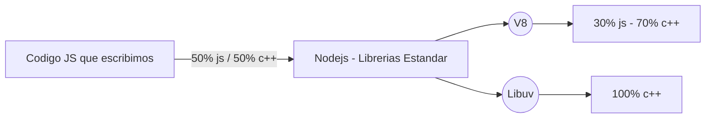
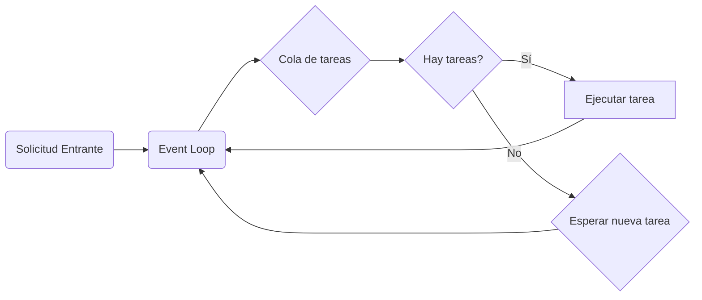

import Mermaid from '../../components/Markdown/Mermaid.astro'

El ecosistema de Node.js ha crecido enormemente en los últimos años, convirtiéndose en una de las herramientas más populares para desarrollar aplicaciones backend modernas. Si estás interesado en comenzar tu camino con Node.js, este artículo te guiará paso a paso desde la instalación hasta la creación de tu primera aplicación básica.

## ¿Qué es Node.js y por qué deberías usarlo?

Node.js es un entorno de ejecución de JavaScript de código abierto y multiplataforma que permite ejecutar JavaScript fuera de un navegador web. Esto significa que puedes utilizar JavaScript para crear aplicaciones de servidor, aplicaciones de línea de comandos y mucho más. Una de las características más destacadas de Node.js es su modelo de E/S no bloqueante, lo que significa que puede manejar muchas conexiones simultáneas de manera eficiente.

**Por qué usar Node.js**:

- **JavaScript en el backend**: Si ya conoces JavaScript, la curva de aprendizaje es muy suave.
- **Rendimiento**: Su modelo basado en eventos y no bloqueante es ideal para aplicaciones en tiempo real.
- **Ecositema**: Una amplia variedad de paquetes disponibles a través de npm, yarn o pnpm.
- **Flexibilidad**: Se puede utilizar para crear una amplia variedad de aplicaciones, desde simples servidores web hasta aplicaciones empresariales complejas.


## Instalación de Node.js: Una Guía Completa

### **Windows**

1.  **Descarga el instalador:**  Visita  [https://nodejs.org/](https://www.google.com/url?sa=E&source=gmail&q=https://nodejs.org/)  y descarga el instalador LTS (Long Term Support) recomendado para la mayoría de los usuarios.
2.  **Ejecuta el instalador:**  Sigue las instrucciones del instalador. Por lo general, solo tienes que hacer clic en "Siguiente" varias veces.
3.  **Verifica la instalación:**  Abre un terminal o PowerShell y ejecuta los siguientes comandos:

```bash
node -v
npm -v
```

> Si la instalación fue exitosa, verás las versiones de Node.js y npm.

### **macOS (usando Homebrew)**

**¿Qué es Homebrew?**  Homebrew es un gestor de paquetes libre y gratuito para macOS que facilita la instalación de software. Si aún no lo tienes instalado, puedes hacerlo siguiendo las instrucciones en  [https://brew.sh/](https://www.google.com/url?sa=E&source=gmail&q=https://brew.sh/).

1.  **Instala Node.js con Homebrew:**
        
```bash
brew install node
```
Este comando instalará la última versión estable de Node.js y npm.
2.  **Verifica la instalación:**
    
```bash
node -v
npm -v
```
    
**Instalación de una versión específica:**  Si necesitas una versión específica de Node.js, puedes usar  `brew install node@<version>`. Por ejemplo, para instalar la versión 16:

```bash
brew install node@21
```

### **Linux**

Los métodos de instalación varían según la distribución de Linux que estés usando. Aquí te presento algunos de los métodos más comunes:

#### **Ubuntu/Debian:**

1.  **Actualiza el índice de paquetes:**
    ```bash
    sudo apt update
    ```
    
2.  **Instala Node.js**
    ```bash
    sudo apt install nodejs
    ```

### **Creando tu primer programa Node.js**

1.  **Crea un archivo:**  Crea un nuevo archivo llamado  `index.js`.
2.  **Escribe el código:**
    ```js
    console.log("¡Hola desde Node.js!");
    ```
    
3.  **Ejecuta el programa:**
    ```bash
    node index.js
    ```
    

### **¿Cómo funciona Node.js?**

Node.js utiliza un motor JavaScript de V8 (el mismo que utiliza Chrome) para ejecutar el código. 
Este motor se ejecuta en un hilo único, pero utiliza un modelo de E/S no bloqueante para manejar múltiples 
solicitudes de manera eficiente. Cuando una operación de E/S (como leer un archivo o realizar una solicitud HTTP)
es solicitada, Node.js no se bloquea esperando a que la operación termine. En su lugar, pasa a la siguiente tarea y,
cuando la operación de E/S está completa, Node.js la coloca en una cola de callbacks.

<Mermaid>

</Mermaid>

<Mermaid>

</Mermaid>

### **Próximos pasos**

-   **npm:**  Aprende a utilizar npm para instalar y gestionar paquetes.
-   **Módulos:**  Explora los módulos integrados de Node.js como  `http`,  `fs`,  `path`, etc.
-   **Frameworks:**  Considera utilizar frameworks como Express.js para agilizar el desarrollo de aplicaciones web.
-   **Asincronía:**  Profundiza en la programación asincrónica con callbacks, promesas y async/await.

**¡Y eso es todo por ahora!**  En este tutorial básico hemos cubierto lo esencial para empezar a trabajar con 
Node.js. En futuros posts exploraremos temas más avanzados como crear servidores web, 
profundizar sobre el Event Loop y el flujo de Node.js.
